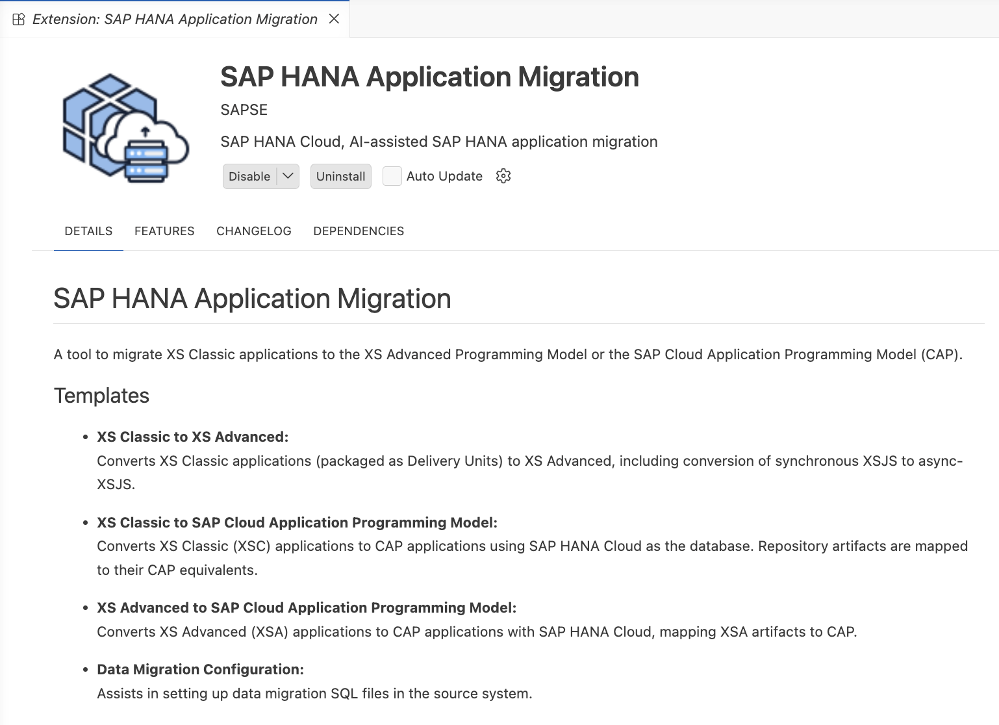
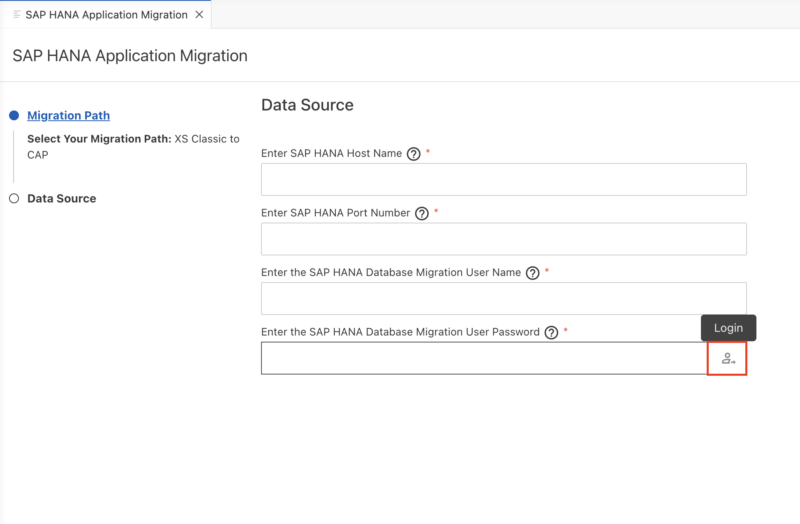
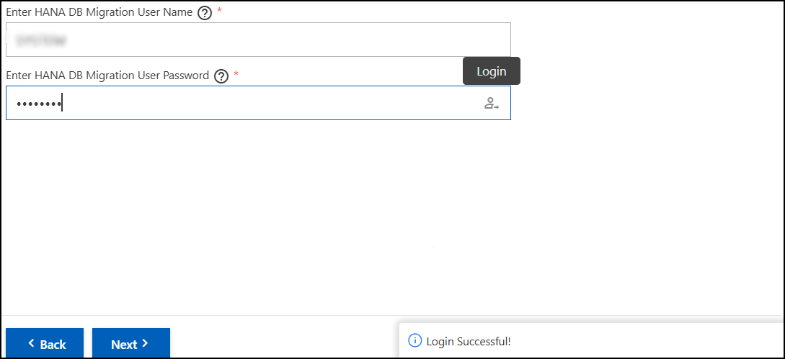
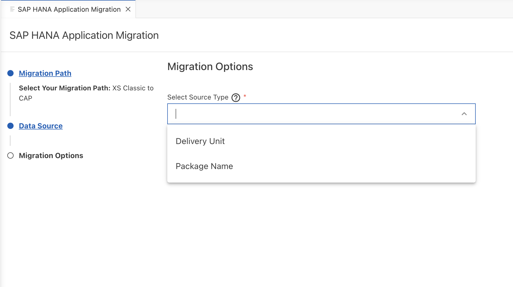
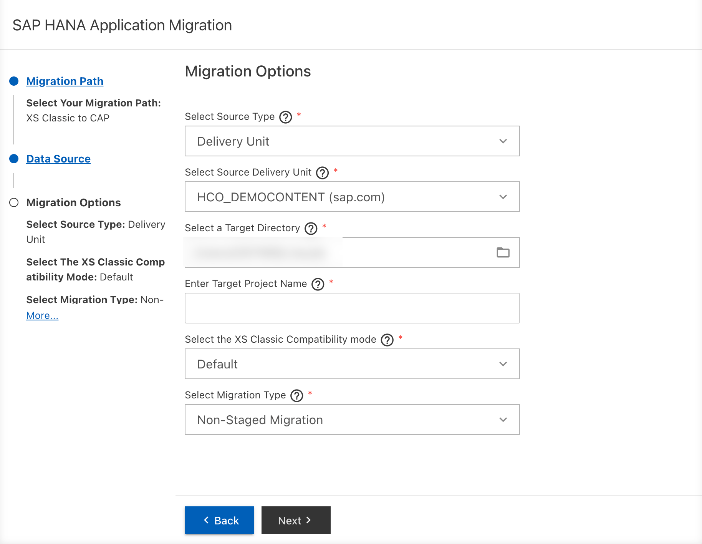
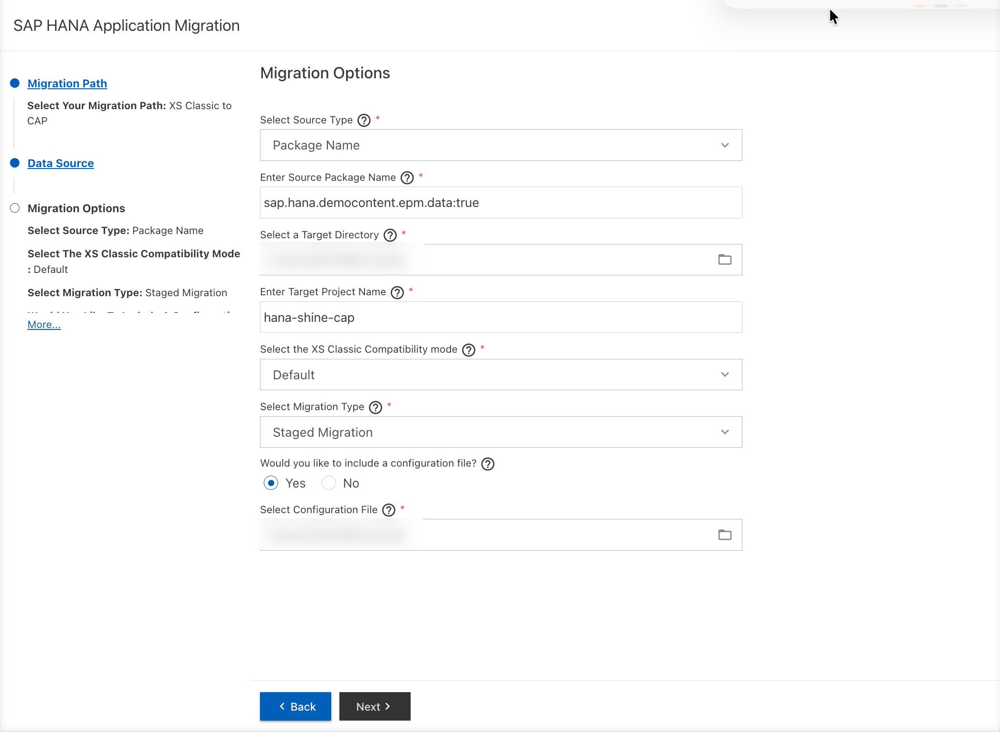
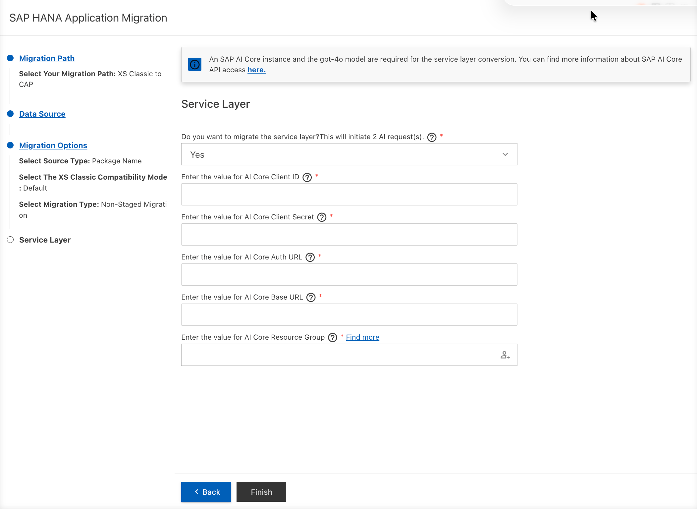
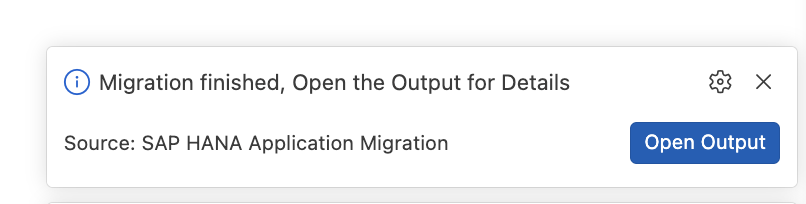

# SAP HANA XS Classic to CAP Migration Using Visual Studio Code

This guide provides step-by-step instructions for migrating SAP HANA XS Classic applications to SAP Cloud Application Programming Model (CAP) using Visual Studio Code with the SAP HANA Application Migration extension.

## Table of Contents
- [Prerequisites](#prerequisites)
- [Installation and Setup](#install-sap-hana-application-migration-extension)
- [Migration Steps](#migration-steps)
  - [Step 1: Invoke the SAP HANA Application Migration Extension](#step-1-invoke-the-sap-hana-application-migration-extension)
  - [Step 2: Configure Migration Options](#step-2-configure-migration-options)
  - [Step 3: Configure SAP GenAI capabilities](#step-3-configure-sap-genai-capabilities)
  - [Step 4: Execute Migration](#step-4-execute-migration)
- [Post-Migration Steps](#post-migration-steps)
- [Next Steps](#next-steps)

---

## Prerequisites

Before starting the migration process in Visual Studio Code, ensure you have the following:

### Software Requirements

| Component | Version | Purpose |
|-----------|---------|---------|
| **Visual Studio Code** | 1.104 or higher | Development IDE |
| **Java (JDK)** | 17 or higher | Required for migration extension |
| **Node.js** | 20 or higher | Required for migration extension |
| **Python** | 3.10 to 3.13 | Required for migration extension |
| **SAP Cloud Connector**(Optional) | Latest | Connects local environment to on-premise HANA|

### SAP Infrastructure Requirements

- **XS Classic Source System**
  - SAP HANA XS Classic on-premise database
  - [HCO_DEMOCONTENT](https://github.com/SAP-samples/hana-shine/releases/download/v2.5.0/HCO_DEMOCONTENT-1.205.0.tgz) Delivery Unit (for this example)
  - Migration user with appropriate privileges ([Procedure to create migration user](https://help.sap.com/docs/SAP_HANA_PLATFORM/58d81eb4c9bc4899ba972c9fe7a1a115/2786447387df41f69a0dad1cc2973e95.html#procedure))

- **SAP BTP Account**
  - SAP BTP Cloud Foundry subaccount
  - Service instances:
    - **SAP HANA Cloud**
    - **SAP HANA Schemas and HDI Containers**
  - (Optional) **SAP AI Core** subscription for Service Layer GenAI conversion - To set up SAP AI Core, see [Initial Setup](https://help.sap.com/docs/sap-ai-core/sap-ai-core-service-guide/initial-setup?version=CLOUD).

> [!NOTE]
> **Service Layer Conversion:** GenAI-based service layer conversion (`.xsodata`, `.xsjs`, `.xsjslib` files) requires additional AI services. This feature  require SAP AI Core Instances.
> Ensure the files in your project contain no sensitive or confidential information, as they will be processed by a Large Language Model (LLM). Review the converted project files carefully before deployment to verify correctness, security, and compliance.
---

## Install SAP HANA Application Migration Extension

1. **Open Visual Studio Code**

2. **Open Extensions View**
   - Click on the Extensions icon in the Activity Bar (left sidebar)
   - Or press `Ctrl+Shift+X` (Windows/Linux) or `Cmd+Shift+X` (macOS)
     
    Install from Visual Studio Code Market Place
   - [SAP HANA Application Migration](https://marketplace.visualstudio.com/items?itemName=SAPSE.xs-migration-bas-extn)

4. **Search for the Extension**
   - Type `SAP HANA Application Migration Extension` in the search box

5. **Install the Extension**
   - Click on the extension in the search results
   - Click the **Install** button

      <p align="center">
      
      </p>

6. **Verify Installation**
   - After installation, the extension should appear in your installed extensions list
   - You may need to reload VS Code

---

## Migration Steps

### Step 1: Invoke the SAP HANA Application Migration Extension

1. **Open Command Palette**
   - Press `F1` or `Ctrl+Shift+P` (Windows/Linux) / `Cmd+Shift+P` (macOS)

2. **Search for Migration Command**
   - Type: `SAP HANA Application Migration`
   - Select: **SAP HANA Application Migration Extension**

### Step 2: Configure Migration Options

#### 2.1 Select Migration Path

1. When the Migration extension Wizard opens, select the migration path. Since we are migrating from XS Classic to SAP CAP, select `XSC to CAP` as your migration path.	

      <p align="center">
      
      </p>

#### 2.2 Enter Source System Details

1. **Enter Host and Port Details**
   - **Enter SAP HANA Host Name**: SAP HANA host name or IP address
   - **Enter SAP HANA Port Number**: SAP HANA port number (typically 3XX15 for tenant databases)
2. **Enter Database Credentials**
   - **Enter the SAP HANA Database Migration User Name**: Migration user username
   - **Enter the SAP HANA Database Migration User Password**: Migration user password
> [!NOTE]
> SAP HANA Database Migration User [Procedure to create migration user](https://help.sap.com/docs/SAP_HANA_PLATFORM/58d81eb4c9bc4899ba972c9fe7a1a115/2786447387df41f69a0dad1cc2973e95.html#procedure)

3. **Click Login** to authenticate

      <p align="center">
      
      </p>

4. **Verify Connection**

   - Once authenticated, you'll see a success message

      <p align="center">
      
      </p>

#### 2.3 Select Source Type

1. **Choose Source Type** from dropdown:
   - **Delivery Unit**: For DU-packaged applications
   - **Package Name**: For package-level migration

      <p align="center">
      
      </p>

2. **Enter Source Identifier**
   
   - **Select Source Delivery Unit**: Select DU name (e.g., `HCO_DEMOCONTENT`)
   
      <p align="center">
      
      </p>
   
   - **For Package**: Enter package name with include subpackages flag
     - Format: `package.name:true` or `package.name:false`
     - Example: `sap.hana.democontent.epm.data:true`
   
      <p align="center">
      
      </p>

#### 2.4 Configure Target Settings

1. **Select Target Directory**
   - Choose the target directory. where the migration results will be stored

2. **Enter Target Folder Name**
   - Specify a unique name for the migrated project
   - Example: `hana-shine-cap`

#### 2.5 Configure XSC Compatibility Mode

1. **Select Compatibility Mode** for Calculation Views:
   - **True**: Enables legacy XS Classic behavior in Calculation Views
   - **False**: Uses native XSA behavior
   - **Default**: Retains existing values in all Calcualtion Views

   > [!NOTE]
   > For more details, see [xsc-compatibility-mode documentation](https://help.sap.com/docs/hana-cloud-database/sap-hana-cloud-sap-hana-database-modeling-guide-for-sap-business-app-studio/70d331c824b5460b82c1fb7f9919ee18.html).

#### 2.6 Configure Migration Type

**Staged Migration** is used when there are objects in our container which have dependent objects in other hdi containers or external schemas. In the case of staged migration, separate hdbsynonyms, hdbsynonymconfigs and hdbgrants will be created for each external hdi container and external schema, the objects in our application depend upon. If all the objects required for deployment are present in our container, a non-staged migration would suffice.
1. **Select Migration Type**:
   - **Non-staged Migration** (Default)
   - **Staged Migration**:

2. **If Staged Migration**, provide configuration file:
   - Browse to your staged migration configuration JSON file
   - See [Staged Migration documentation](https://help.sap.com/docs/SAP_HANA_PLATFORM/58d81eb4c9bc4899ba972c9fe7a1a115/954fd85b616b48a9b09a2f9b471eef41.html) for details

      <p align="center">
      
      </p>

   **Example Configuration File:**
   ```json
   {
     "target": {
       "schema": "TARGET_SCHEMA",
       "grantor": "GRANTOR_USER"
     },
     "external_dependencies": [
       {
         "schema": "EXTERNAL_SCHEMA_1",
         "objects": ["TABLE1", "VIEW1"]
       }
     ]
   }
   ```
    ** Click Next**
### Step 3 :Configure SAP GenAI capabilities

#### 3.1 Service Layer using GenAI capabilities.

1. **Service Layer Migration**
    - Select ***Yes*** for service layer migration. Service layer migration uses SAP generative-AI tools to convert XS objects to SAP CAP service definitions and custom handlers.
      <p align="center">
      
      </p>
>[!NOTE]
>An SAP AI Core instance & service key and the gpt-4o model are required for the service layer conversion. You can find more information about SAP AI Core API access [here](https://help.sap.com/docs/sap-ai-core/sap-ai-core-service-guide/what-is-sap-ai-core?locale=en-US).

#### 3.2 Enter SAP AI Core credentials.

1. Enter the value for AI Core Client ID
2. Enter the value for AI Core Client Secret
3. Enter the value for AI Core Auth URL
4. Enter the value for AI Core Base URL
5. Enter the value for AI Core Resource Group

> [!NOTE]
> More Information refer [SAP AI CORE Quick Start](https://help.sap.com/docs/sap-ai-core/generative-ai/quick-start?version=CLOUD)

### Step 4: Execute Migration

1. **Click "Finish"** to start migration

2. **Monitor Progress**
   - A notification will appear showing migration progress
   - Check the Output panel for detailed logs:
     - View → Output
     - Select "SAP HANA Application Migration" from dropdown

      <p align="center">
      
      </p>

4. **Migration Complete**
   - The extension will generate:
     - **CAP project structure** with migrated artifacts
     - **db/** folder with CDS models and HANA artifacts
     - **srv/** folder (if service layer conversion enabled)
     - **report.html** with migration summary and manual review items

5. **Open Migration Report**
   - Locate `report.html` in your target folder
   - Open in browser to review:
     - Successfully migrated artifacts
     - Items requiring manual intervention
     - Known issues and recommendations

---

## Post-Migration Steps

After migration completes, follow these steps to prepare for deployment:

### 1. Review Migration Report

- Open `report.html` in your browser
- Review all warnings and errors
- Note items requiring manual changes

### 2. Database Post-Migration Changes

Follow the detailed steps in the main [README.md - Step 5: Database Post Migration Changes](README.md#step-5-database-post-migration-changes)

Key actions include:
- Remove references to external schemas not yet migrated
- Configure synonyms for public schemas (SYS, _SYS_BI)
- Update role configurations
- Fix entity references and naming convention changes
- Adjust SQL syntax for HANA Cloud compatibility

### 3. Service Layer Post-Migration Changes (If Applicable)

If you enabled service layer conversion, follow [README.md - Step 6: Service Layer Migration](README.md#step-6-service-layer-migration)

Key actions include:
- Validate generated `service.cds` and `service.js` files
- Review custom handlers in `handlers/` folder
- Update import paths
- Test service endpoints
- Refine GenAI-generated code

### 4. Build the Project

```bash
cds build --profile production
```

### 6. Deploy to SAP HANA Cloud

Follow [README.md - Step 7: Deployment](README.md#step-7-deployment-of-the-migrated-database-artifacts)

---

## Next Steps

- **Data Migration**: See [DataMigration-VSCode.md](DataMigration-VSCode.md) for data migration procedures
- **Deployment**: Deploy artifacts to SAP HANA Cloud
- **Testing**: Validate migrated functionality
- **Optimization**: Review and optimize generated code

## Additional Resources
- [SAP Hana Application Migration Vscode](https://help.sap.com/docs/hana-cloud/sap-hana-cloud-migration-guide/migrate-xs-classic-application-to-sap-cap-and-sap-hana-cloud-with-sap-hana-application-migration-assistant-in-visual-studio-code)
- [Main README](README.md) - Complete migration guide
- [Supported Features](supportedFeatures.md) - List of supported artifacts
- [Data Migration Guide](DataMigration-VSCode.md) - Data migration procedures
- [SAP HANA Cloud Migration Guide](https://help.sap.com/docs/hana-cloud/sap-hana-cloud-migration-guide)
- [SAP CAP Documentation](https://cap.cloud.sap/docs/)

## Troubleshooting

### Common Issues

**Extension not appearing in Command Palette**
- Verify extension is installed and enabled
- Reload VS Code window (Ctrl+R / Cmd+R)
- Check VS Code version meets minimum requirements

**Connection to source system fails**
- Verify host and post is reachable using curl
- Ensure migration user has correct privileges

**Migration fails during execution**
- Check Output panel for detailed error messages
- Verify source artifacts have no errors
- Ensure all prerequisites are met
- Review migration report for specific issues

**GenAI service layer conversion not available**
- Verify AI services are configured in BTP
- Check your BTP account entitlements
- Contact SAP support for AI service access

---

For additional support, see [README.md - How to Obtain Support](README.md#how-to-obtain-support).
